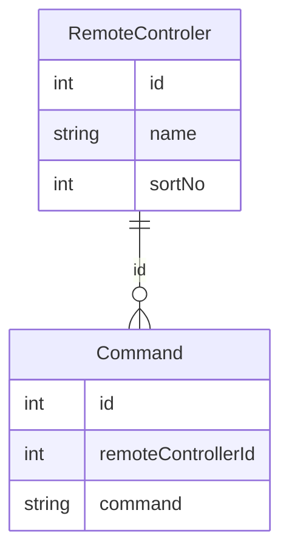

# 仕様

## フロント

### 必要な画面

- リモコン操作画面
  - 操作対象を切り替えることが可能なこと
- 管理画面
  - 新規登録
  - 既存削除
  - 並び替え（？）

## バックエンド

### DB

リモコンの登録情報管理

```mermaid
erDiagram

RemoteControler {
    int id
    string name
    int sortNo
}

Command {
    int id
    int remoteControllerId
    string command
}

RemoteControler ||--o{ Command : id

```
